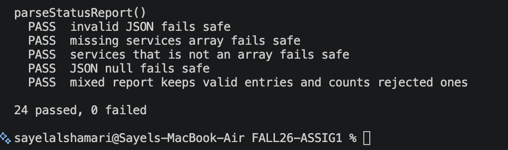

# Mission 1: Python habits that break JavaScript security

## Evidence

## Connections: Python to JavaScript

For each check you implemented, write how you would do it in Python and how you did it in JavaScript.

| Rule | Python | JavaScript, as in my code |
|---|---|---|
| raw is a dictionary or object, not a list | `isinstance(raw, dict)`| `raw !== null && typeof raw === "object" && !Array.isArray(raw)` |
| name is a non-empty string after trimming | `isinstance(name, str) and name.strip() != ""` | `typeof raw.name === "string" && raw.name.trim() !== ""` |
| status is one of the allowed values | | |`status in ALLOWED_STATUS` | `ALLOWED_STATUS.includes(raw.status)` |
| online is a real boolean | | |`isinstance(online, bool)` | `typeof raw.online === "boolean"` |
| latencyMs is a finite number ≥ 0 | | |`isinstance(latencyMs, (int, float)) and latencyMs >= 0` | `typeof raw.latencyMs === "number" && Number.isFinite(raw.latencyMs) && raw.latencyMs >= 0` |
| invalid JSON does not crash the program | | |`try/except` | `try/catch` |

## Questions

1. Why is `latencyMs: 0` a trap for code such as `if (!raw.latencyMs) return null;`?

   > because as  0 is falsy in JavaScript, so the code can reject it even if 0 is a valid latency value. This can make the validation wrong.

2. Your function builds a **new** object and ignores fields like `isAdmin`. Describe in two or three sentences what could go wrong later in an application that copied **every** field it received.

   >  If the app copy every field, someone can add something like isAdmin and the app might trust it later. Making a new object only keeps the fields we actually want.we 

## Documentation log

| Page I used, with URL | One thing I learned from it |
|---|---|
| Unit 1.2 slides | I learned that 0 is falsy in JavaScript. |