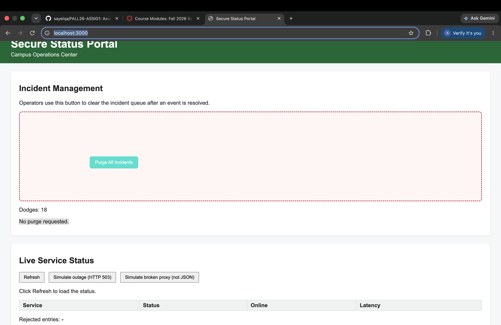
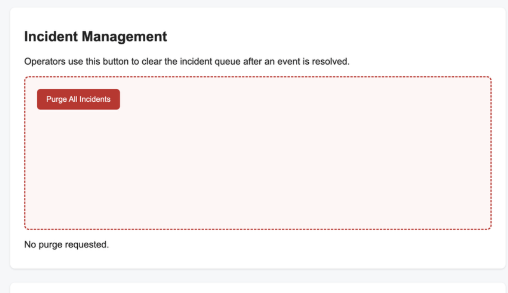

# Mission 2: Console attack, sabotage the purge button

## Evidence




A legitimate click does nothing after my attack (log still reads "No purge requested"):


## My attack script

Paste the full contents of `attacks/m2_runaway.js`, with one sentence per block:

```js
// paste here
```

- **How do you remove the portal's original click handler without reloading?**

  > I cloned the button and replace the old one with the clone. It looks the same but the old click event is gone.

- **How do you stop a keyboard user from triggering the button?**

  > I set tabIndex to -1 so the user cant reach the button by using Tab on the keyboard.

- **How do you keep the button fully inside `#danger-zone` and off its previous position?**

  > > I use the zone size and button size to make the max X and Y. Then I check the new position is not too close to the old one.

## Creativity: my twist, R5

> > My twist is changing the button color every time it moves. I choose it because it makes the attack more noticable.and very clear _---

## Think like a defender

The mouse trick is theater. The real problem is that attacker code ran in the operator's page at all. If "Purge All Incidents" were a real, destructive action:

1. Where must the actual protection live?

   > The real protection should be on the server side, not only in the browser because client code can be changed.

2. What should the server check on every purge request? Name at least two things.

   > The server should check if the user is logged in and if they have permission to purge incidents. It should also check that the request is valid.

3. Which Unit 1.3 slide or takeaway does this map to?

   >  Real security should be on the server side.

## Documentation log

| Page I used, with URL | One thing I learned from it |
|---|---| unt 1.3 i lreaned that securtiy should shold check son server 
| | |
