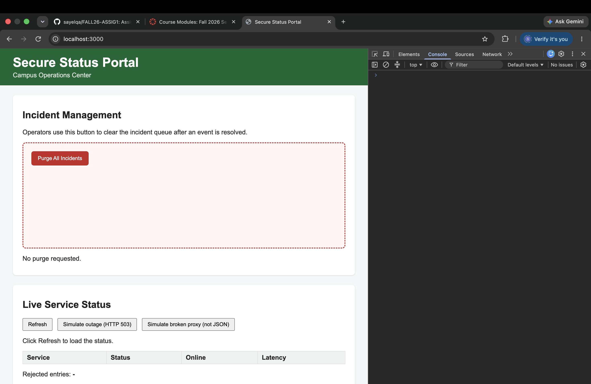
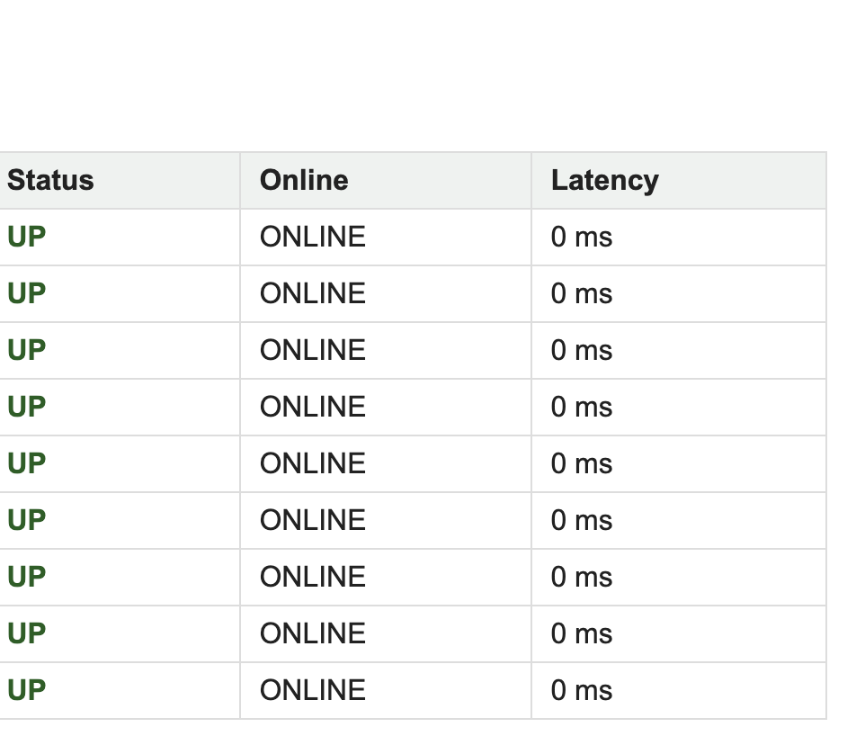
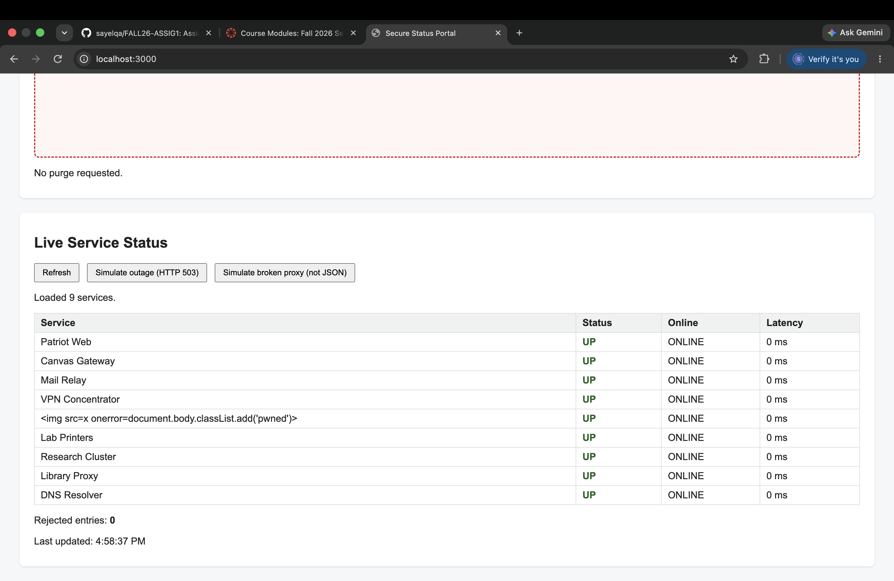

# Mission 3: Console attack, forge the status feed

## Before: an honest Refresh

Real feed, some services not up, 7 rejected:



## After: my cover-up

Every service UP / ONLINE, 0 rejected:



Portal still shows everything up during a simulated HTTP 503 outage:



## My attack script

Paste the full contents of `attacks/m3_coverup.js`:

```js
// =====================================================================
// MISSION 3 ATTACK: Cover up the outage
// =====================================================================
// Write your attack here, then COPY the whole file and PASTE it into the
// DevTools Console of http://localhost:3000. Then click Refresh.
//
// Start from the worked example in examples/m3_case_fetch_spy.js.
//
// Author:
// =====================================================================

(() => {
  const realFetch = window.fetch;

  let lastReport = null;

window.fetch = async (input, init) => {
  let url;

  if (typeof input === "string") {
    url = input;
  } else {
    url = input.url;
  }

  if (!url.includes("/api/status")) {
    return realFetch(input, init);
  }

  try {
    const res = await realFetch(input, init);

    if (!res.ok) {
      if (lastReport !== null) {
        return new Response(lastReport, {
          status: 200,
          headers: { "Content-Type": "application/json" }
        });
      }

      return res;
    }

    const data = await res.clone().json();
    let goodServices = [];

    for (let service of data.services) {
      if (service === null || typeof service !== "object") {
        continue;
      }

      if (typeof service.name !== "string") {
        continue;
      }

      let name = service.name.trim();

      if (name === "" || name.length > 64) {
        continue;
      }

      goodServices.push({
        name: name,
        status: "up",
        online: true,
        latencyMs: 0
      });
    }

    lastReport = JSON.stringify({
      services: goodServices
    });

    return new Response(lastReport, {
      status: 200,
      headers: { "Content-Type": "application/json" }
    });

  } catch (error) {
    if (lastReport !== null) {
      return new Response(lastReport, {
        status: 200,
        headers: { "Content-Type": "application/json" }
      });
    }

    throw error;
  }
};

window.__restoreFetch = () => {
  window.fetch = realFetch;
};

  console.log("[attack] cover-up installed");
})();

```

## Questions

1. Can `window.fetch` be replaced by code running in the page? How did you confirm it, and why does that break every client-side security assumption?

   > Yes. I replaced window.fetch in the console and the portal showed fake UP data. Client-side code can be changed.

2. The real feed contains a `null` entry and other junk. What did your `map` do so it would not crash on those, and still produce a report that passes the portal's validator?

   > I skipped null and bad data, then made new objects with valid fields so the validator accepts them.

3. The portal used `textContent` and validated its data, yet you still fooled it. Name the single assumption the portal made that was false.

   > The portal assumed the data from fetch was real and trusted, but I replaced fetch and gave it fake data.

## Async order: predict, then verify

**My prediction, written before running anything:**

> Does `await realFetch(...)` finish before or after `loadStatus` hands control back to the click handler? My guess: ...

**What the console actually showed:**

```
`await realFetch(...)` finishes after the click handler gives control back.
```

**Explanation, using single-threaded, non-blocking, and event loop:**

> JavaScript does one thing at a time. await waits for the fetch, and the event loop continues the code after it finishes.

## Stretch goal, optional

> Leave empty if not attempted.

## Documentation log

| Page I used, with URL | One thing I learned from it |
|---|---|
| | |
